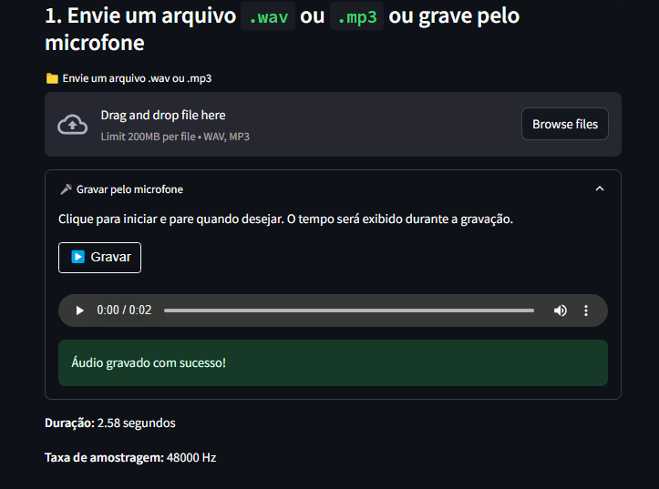

# 🔊 Analisador de Espectro de Áudio

Aplicativo web interativo criado com [Streamlit](https://streamlit.io) para:

- Gravar ou enviar arquivos de áudio (`.wav` ou `.mp3`)
- Visualizar a forma de onda e o espectro de frequência
- Aplicar filtro de remoção de ruído
- Reproduzir o áudio processado
- Exportar o espectro como CSV e o áudio processado como MP3

## 🚀 Demonstração

> Interface baseada na web, basta rodar localmente e abrir no navegador.

## 🖼️ Capturas de Tela

| Gravação de áudio                  | Espectro de Frequência             | Exportação                         |
| ---------------------------------- | ---------------------------------- | ---------------------------------- |
|  |  |  |

## 📦 Requisitos

- Python 3.8 ou superior
- FFmpeg (para uso com `pydub`)

### Instalação do FFmpeg

**Windows**

```bash
1. Baixe em: https://ffmpeg.org/download.html

2. Extraia o conteúdo

3. Adicione o caminho da pasta bin ao PATH do sistema
```

## 📥 Instalação

Clone o repositório e instale as dependências:

```bash
1. git clone https://github.com/Projeto-Fisica-2025/Analisador-Audio.git
2. cd Analisador-Audio
3. venv\Scripts\activate
4. pip install -r requirements.txt
```

## ▶️ Executar o App

Inicie o Streamlit com:

```bash
streamlit run app.py
```

O navegador será aberto automaticamente em `http://localhost:8501`.

## 📁 Estrutura do Projeto

```bash
Analisador-Audio/
│
├── app.py                # Aplicativo principal
├── requirements.txt      # Arquivo de dependências
├── README.md             # Documentação do projeto
└── docs/
    └── img/              # Imagens de captura de tela usadas no README
```

## 🔧 Funcionalidades

- 📁 Upload de .wav e .mp3

- 🎤 Gravação de áudio via microfone do navegador

- 🧹 Filtro de remoção de ruído baseado nos primeiros segundos do áudio

- 📊 Visualização interativa da forma de onda (tempo) e espectro de frequência (FFT) com Plotly

- 📥 Exportação:

  - CSV com frequências e amplitudes

  - Áudio processado em .mp3

Feito por [Henrique de Almeida Silva](https://github.com/Dev-Henrique-Almeida) e [Claudierio Baltazar Barra Nova](https://github.com/Claudierio)
